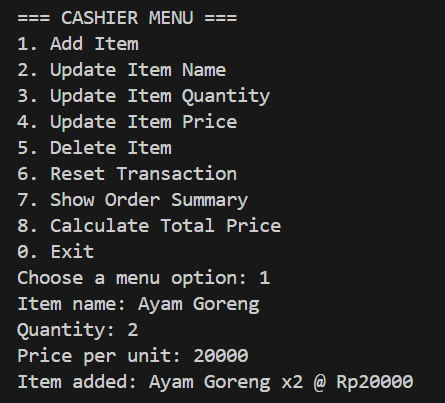
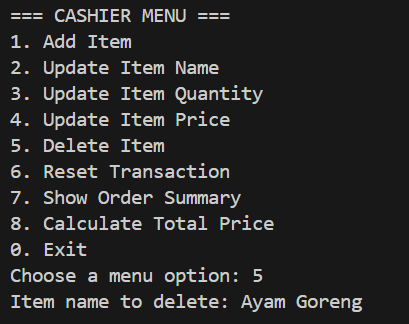
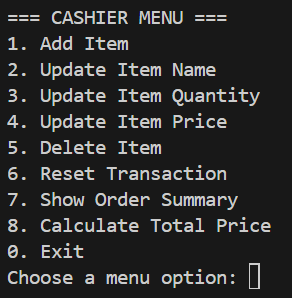

# 🧾 Python Cashier App (Console-Based)

A simple console-based cashier application to manage transactions, built with object-oriented Python. This project is suitable for small shops or for learning purposes like OOP, flow control, and basic system design.

---

## Background

Manual cashier operations often involve repetitive tasks such as tracking items, calculating totals, applying discounts, and handling errors. This project was created to automate those tasks with a clean and interactive command-line interface.

---

## Flowchart

---

## 🚀 Features

### 1. Add items with name, quantity, and unit price

### 2. Update item name, quantity, or price

### 3. Delete individual items

### 4. Reset entire cart

### 5. View cart in a clean table format (using `tabulate`)

### 6. Auto-calculate total price with tiered discounts

### 7. Interactive menu system with input handling

