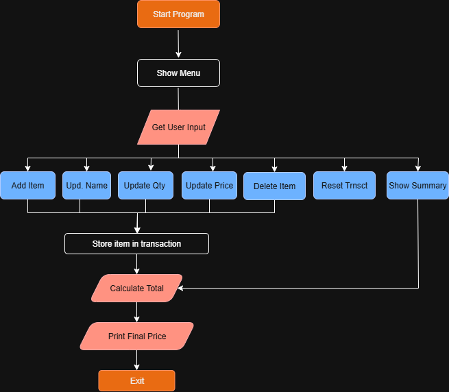

# 🧾 Python Cashier App (Console-Based)

A simple console-based cashier application to manage transactions, built with object-oriented Python. This project is suitable for small shops or for learning purposes like OOP, flow control, and basic system design.

---

## Background

Manual cashier operations often involve repetitive tasks such as tracking items, calculating totals, applying discounts, and handling errors. This project was created to automate those tasks with a clean and interactive command-line interface.

---

## Program Descriptions

### `main.py`

Handles the main program flow. It shows a menu where users can:

- Add, update, or delete items  
- View the cart summary  
- Calculate total price with discount  
- Reset the cart  
- Exit the app  

All user interactions happen here using a simple CLI (Command Line Interface).

---

### `transaction.py`

Contains the `Transaction` class which handles all the core logic:

- Add or update item data  
- Delete or reset items  
- Show items in table format (using `tabulate`)  
- Calculate total and apply discount rules  

This file focuses on processing transactions cleanly using object-oriented programming (OOP).

---
## Flowchart

---

## Features

### 1. Add items with name, quantity, and unit price

### 2. Update item name, quantity, or price

### 3. Delete individual items

### 4. Reset entire cart

### 5. View cart in a clean table format (using `tabulate`)

### 6. Auto-calculate total price with tiered discounts

### 7. Interactive menu system with input handling

---

##  Conclusion
This project successfully implements a basic console-based cashier system using object-oriented Python. It automates item input, editing, and transaction calculations with a clean tabulated display. The code structure follows OOP best practices, making it easy to maintain and expand in the future.

With this project, users can simulate a real transaction flow, perform basic CRUD operations, and apply tiered discount logic in a user-friendly CLI interface.

